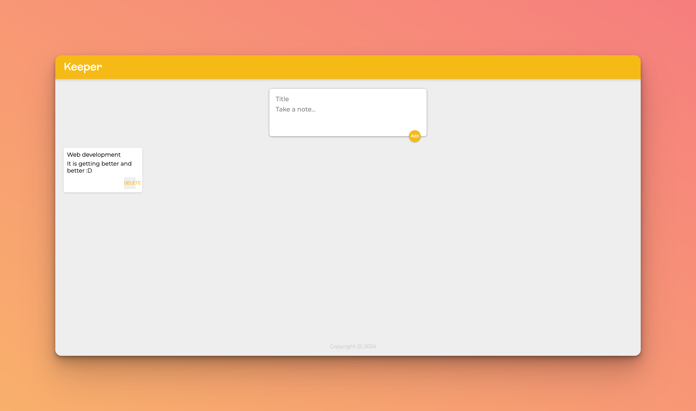

# Keeper App

## Description

Keeper is a note-taking React application inspired by Google Keep. It allows users to create, view, and delete notes dynamically. Each note consists of a title and content. The application showcases React's powerful state management and component-based architecture.



## Key Learnings

- **State Management**: Utilized React's `useState` hook for managing the application's state.
- **Component-Based Structure**: Developed a clear understanding of creating and using React components.
- **Event Handling**: Implemented event handlers to manage user interactions.
- **Dynamic Rendering**: Practiced rendering components dynamically based on state changes.
- **Props and Lifting State Up**: Learned to pass data between parent and child components using props.

## Installation and Setup

1. Clone the repository:

   ```bash
   git clone https://github.com/your-username/keeper-app.git
   cd keeper-app
   ```

2. Install the required dependencies:

   ```bash
   npm install
   ```

3. Start the application:
   ```bash
   npm start
   ```

## Features

- **Note Creation**: Users can add new notes using a simple form.
- **Note Display**: Notes are displayed in a grid format.
- **Delete Functionality**: Each note includes a delete button to remove the note from the list.

## Components

- **Header**: Displays the application's title.
- **Footer**: Shows the current year as a copyright notice.
- **CreateArea**: Contains the form to create new notes.
- **Note**: Represents each individual note.

## Technologies Used

- React.js
- CSS for styling

## Future Enhancements

- Implement search functionality to filter notes.
- Add the ability to edit existing notes.
- Integrate with a backend database for persistent storage.
- Include user authentication to manage personal notes.

## Running the Application

After starting the application with `npm start`, it will be available at [http://localhost:3000](http://localhost:3000).

## Project Structure

- `src/components/Header.jsx`: Defines the header component.
- `src/components/Footer.jsx`: Contains the footer component.
- `src/components/Note.jsx`: Component for displaying each note.
- `src/components/CreateArea.jsx`: Manages the note creation form.
- `src/App.jsx`: The main application component combining all other components.
